## Part 1. Установка ОС  

### 1.1. Сети и маски  
1) Для определения адреса сети 192.167.38.54/13 использую команду:  
ipcalc 192.160.0.0/13  
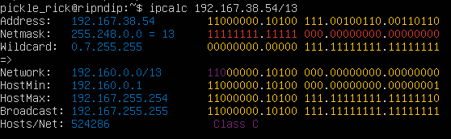  
Рис. 1 — Сети и маски  
Адрес сети: 192.160.0.0/13  

2) Для перевода маски 255.255.255.0 в префиксную и двоичную запись использую команду:  
ipcalc 0.0.0.0 255.255.255.0  
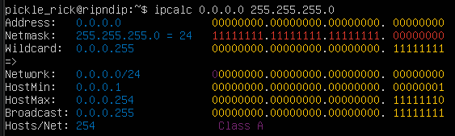  
Рис. 2 — Перевод формата записи маски  
Префиксная форма: /24  
Двоичная запись: 11111111.11111111.11111111.00000000  
Для перевода /15 в обычную и двоичную использую:  
ipcalc 0.0.0.0/15  
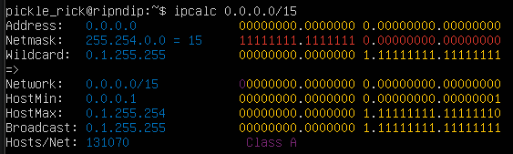  
Рис. 3 — Перевод формата записи маски  
Обычная форма: 255.254.0.0  
Двоичная запись: 11111111.11111110.00000000.00000000  
Для перевода 11111111.11111111.11111111.11110000 в обычную и префиксную запись, считаю количество единиц, так как двоичную форму адреса передать на вход ipcalc нельзя:  
ipcalc 0.0.0.0/28  
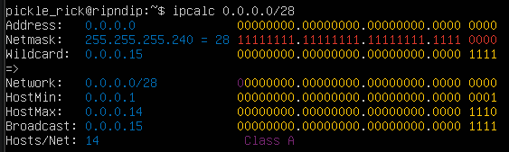  
Рис. 4 — Перевод формата записи маски  
Обычная запись маски: 255.255.255.240  
Префексная запись: /28  

3) Для выявления минимального и максимального хостов в сети 12.167.38.4 при масках: /8, 11111111.11111111.00000000.00000000, 255.255.254.0 и /4 использую 4 команды:  
ipcalc 12.167.38.4/8  
ipcalc 12.167.38.4/16  
ipcalc 12.167.38.4 255.255.254.0  
ipcalc 12.167.38.4/4  
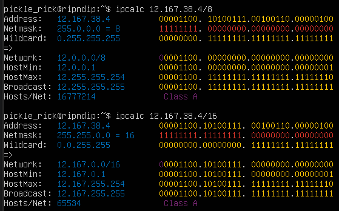  
Рис. 5 — Минимальные и максимальные хосты в сети /8 и /16  
Минимальный хост: 12.0.0.1 и 12.167.0.1  
Максимальный хост: 12.255.255.254 и 12.167.255.254  
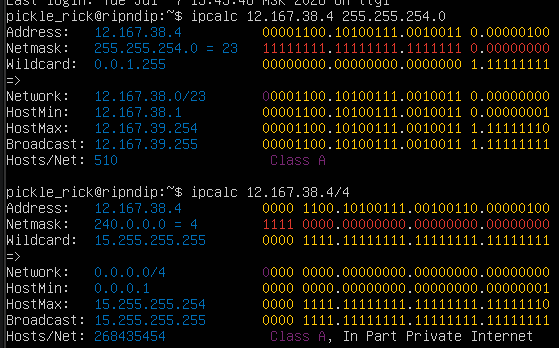  
Рис. 6 — Минимальные и максимальные хосты в сети 255.255.254.0 и /4 
Минимальный хост: 12.167.38.1 и 0.0.0.1  
Максимальный хост: 12.167.39.254 и 15.255.255.254  

### 1.2. localhost  
Весь диапазон адресов 127.0.0.0/8 (от 127.0.0.0 до 127.255.255.255) зарезервирован для loopback-целей. Это означает, что любой пакет, отправленный на любой адрес из этого диапазона, будет "замкнут" обратно на ту же машину, поэтому для ip 127.0.0.2, 127.1.0.1 обращение возможно, а для 194.34.23.100, 128.0.0.1 - нет.  

### 1.3. Диапазоны и сегменты сетей  
1) Из перечисленных IP можно использовать в качестве публичного: 134.43.0.2, 192.169.168.1, 172.68.0.2, 192.172.0.1, 172.0.2.1, а только в качестве частных: 10.0.0.45, 192.168.4.2, 172.20.250.4, 172.16.255.255, 10.10.10.10.  
Класс	Диапазон	                   Маска подсети  
A	    10.0.0.0 – 10.255.255.255	   /8 (255.0.0.0)  
B	    172.16.0.0 – 172.31.255.255	   /12 (255.240.0.0)  
C	    192.168.0.0 – 192.168.255.255  /16 (255.255.0.0)  

2) Для того, чтобы установить диапозон ip адресов, нужно включить биты из Wildcard в Network  
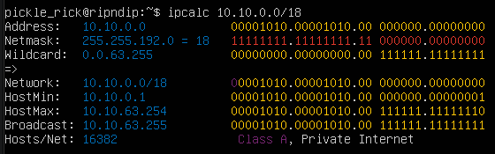  
Рис.7 - Вывод комманды ipcalc 10.10.0.0/18  
Результат: 10.10.0.0 — сетевой, 10.10.63.255 - широковещательный  
Из перечисленных IP-адресов шлюза у сети 10.10.0.0/18 возможны: 10.10.0.2, 10.10.10.10, 10.10.1.255  

##  Part 2. Статическая маршрутизация между двумя машинами  
Команда ip a показывает существующие сетевые интерфейсы:  
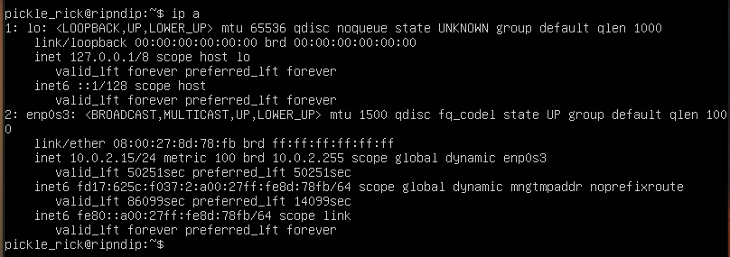  
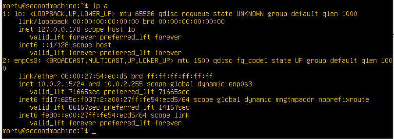  
Рис.8 - Скрин с вызовом и выводом использованной команды на машинах 1 и 2  
lo - локальная петля  
enp0s3 - проводной сетевой интерфейс  
UP - состояние (включено)  
link/ether - MAC-адрес: 08:00:27:8d:78:fb  
inet - IPv4-адрес: 10.0.2.15/24  
inet6 - IPv6-адрес  

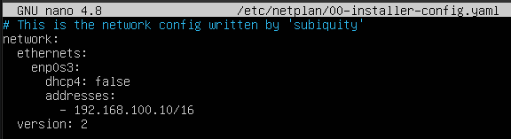  
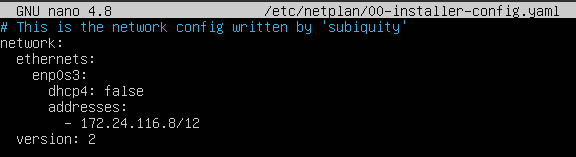  
Рис.9 - Скрин с содержанием изменённого файла etc/netplan/00-installer-config.yaml для каждой машины  
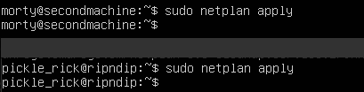  
Рис.10 - Скрин с вызовом и выводом команды netplan apply  

### 2.1. Добавление статического маршрута вручную  
Прежде нужно убедиться, что машины физически (виртуально) подключены к одному коммутатору.В настройках VirtualBox обеих машин выбераю тип подключения «Внутренняя сеть» (Internal Network) и указываю одинаковое имя intnet.  
Имена сетевых интерфейсов беру из предыдущей части - enp0s3  
С помощью команды ipcalc выясняем адреса сетей. И добавляем статический маршрут от одной машины до другой и обратно при помощи команд:  
ip r add ... dev enp0s3  
Проверяем соединение пингом  
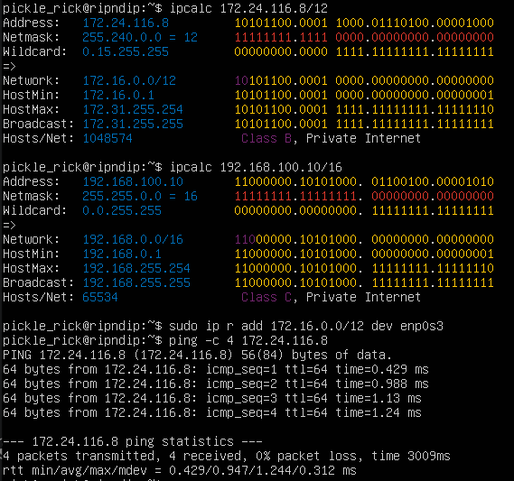  
Рис.11 - ipcalc, ip r add и ping на первой машине  
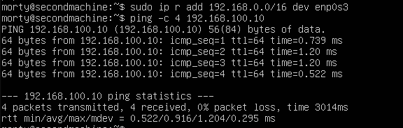  
Рис.12 - ip r add и ping на второй машине  

### 2.2. Добавление статического маршрута с сохранением  
После перезапуска машин, добавляю статический маршрут от одной машины до другой с помощью файла /etc/netplan/00-installer-config.yaml.  
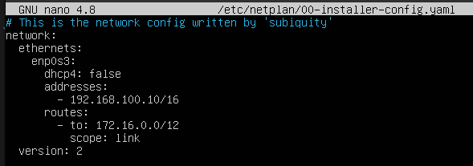  
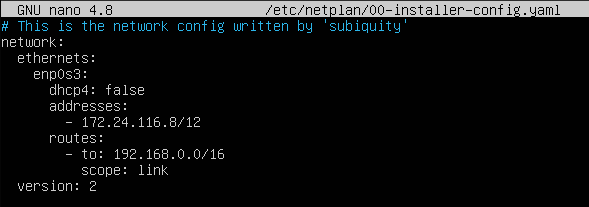  
Рис.13 - Скрины с содержанием изменённого файла /etc/netplan/00-installer-config.yaml.  

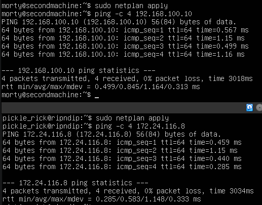  
Рис.14 - Пропингованные соединения между машинами  

## Part 3. Утилита iperf3  
### 3.1. Скорость соединения  
8 Mbps - 1 MB/s  
100 MB/s - 800 000 Kbps  
1 Gbps - 1000 Mbps  
### Утилита iperf3  
Для установки утилиты iperf3, нужно восстановить подключение к интернету, в настройках виртуальной машины (в VirtualBox/VMware) добавить второй сетевой адаптер и включить его в режим NAT, перезапустить машину, с помощью команды ip a выяснить название нового адаптера и прописать его в /etc/netplan/00-installer-config.yaml:  
    enp0s8:  
      dhcp4: true  
Чтобы протестировать пропускную способность сети, нужно запустить iperf3 в режиме сервера с помощью флага -s. По умолчанию он будет прослушивать порт 5201:  
iperf3 -s -f K  
На локальной машине запустим iperf3 в режиме клиента с помощью флага -c и укажем хост, на котором работает сервер (используем либо его IP-адрес, либо домен, либо имя хоста):  
iperf3 -c 192.168.10.1 -f K  
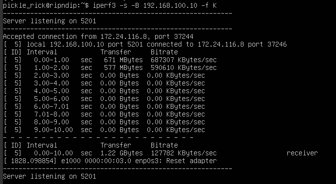  
Рис.15 - Результат iperf3 на первой машине  
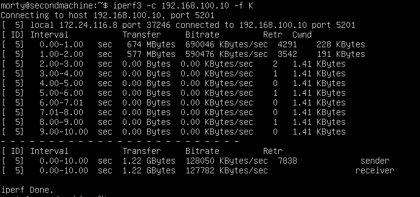  
Рис.16 - Результат iperf3 на второй машине  

## Part 4. Сетевой экран  
### 4.1. Утилита iptables  
Создание файла /etc/firewall.sh, имитирующего файрвол, на ws1 и ws2:  
  
Рис.17 - /etc/firewall.sh на ws1  
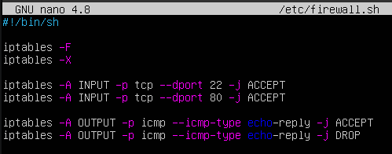  
Рис.18 - /etc/firewall.sh на ws2  
Запуск файлов и проверка разрешений:  
sudo iptables -L -n -v  
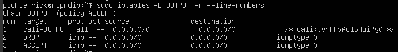  
Рис.19 - sudo iptables -L -n -v  на ws1  
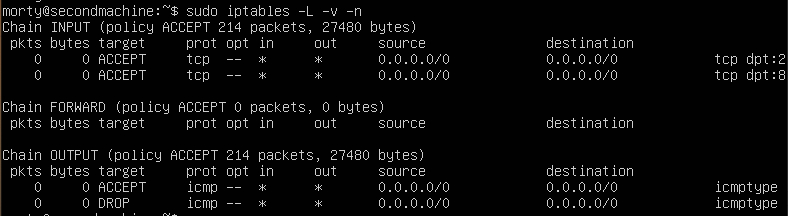  
Рис.20 - sudo iptables -L -n -v  на ws2  
Теперь нужно пропинговать серверы для проверки работы правил  
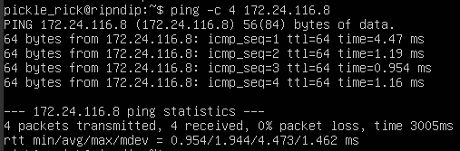  
Рис.21 - Результаты пинга ws2 с ws1  
Когда ws2 отправляет ответ, её пакет в цепочке OUTPUT натыкается первым делом на разрешающее правило (ACCEPT). Пакет улетает к ws1, а идущий следом запрет уже не обрабатывается  
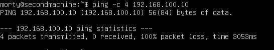  
Рис.22 - Результаты пинга ws1 с ws2  
Запрос доходит до ws1, но когда ws1 пытается отправить ответ обратно, пакет попадает в её цепочку OUTPUT. Там первым стоит запрещающее правило (DROP), пакет уничтожается, а до разрешающего правила дело не доходит  