## Part 1. Готовый докер  
  
Возьми официальный докер-образ с nginx и выкачай его при помощи docker pull  
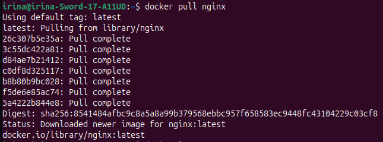  
Проверь наличие докер-образа через docker images  
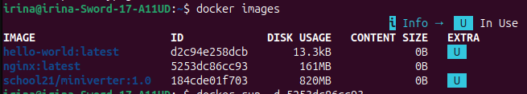  
Создай и запусти контейнер на основе образа через docker run -d [image_id|repository]  
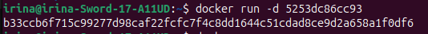  
Проверь, что контейнер запустился через docker ps  
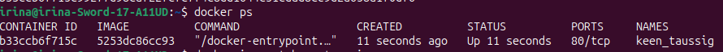  
Посмотри информацию о контейнере через docker inspect [container_id|container_name]  
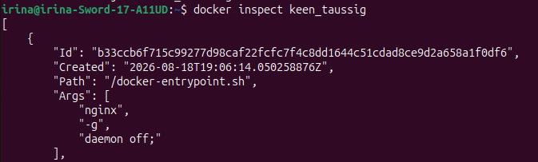  
По выводу команды определи и помести в отчёт размер контейнера, список замапленных портов и ip контейнера  
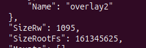  
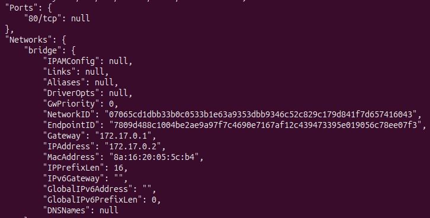  
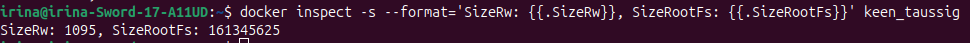  
Останови докер контейнер через docker stop [container_id|container_name]  
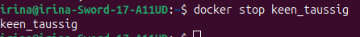  
Проверь, что контейнер остановился через docker ps  
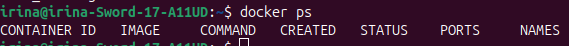  
Запусти докер с портами 80 и 443 в контейнере, замапленными на такие же порты на локальной машине, через команду run  
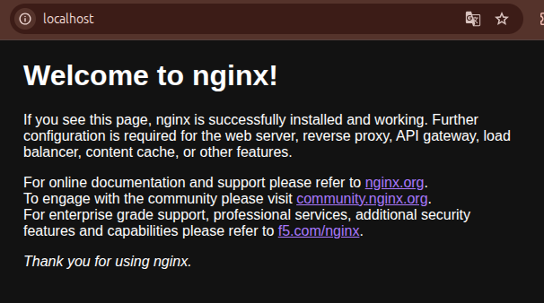  
Проверь, что в браузере по адресу localhost:80 доступна стартовая страница nginx  
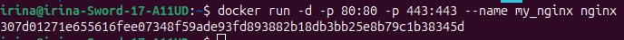  
Перезапусти докер контейнер через docker restart [container_id|container_name]  
Проверь любым способом, что контейнер запустился  
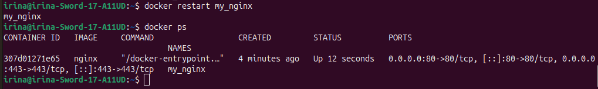  

## Part 2. Операции с контейнером  
Прочитай конфигурационный файл nginx.conf внутри докер контейнера через команду exec.  
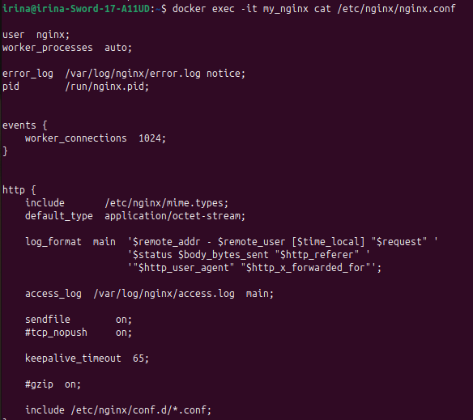  
Создай на локальной машине файл nginx.conf.  
Настрой в нем по пути /status отдачу страницы статуса сервера nginx.  
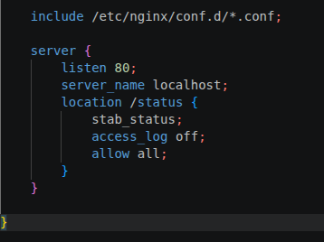  
Скопируй созданный файл nginx.conf внутрь докер-контейнера через команду docker cp.  
Перезапусти nginx внутри докер-контейнера через команду exec.  
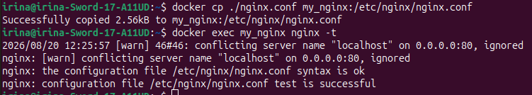  
наша блочная деректива server и порт и localhost игнорируется, так как перед реализацией есть строка  
include /etc/nginx/conf.d/*.conf;
а в дерриктории по этому адресу есть default.conf в котором прописаны порт 80 и localhost  
Для исправления, нужно удалить этот файл, перезагрузить контейнер.  
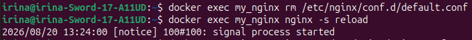  
Проверь, что по адресу localhost:80/status отдается страничка со статусом сервера nginx.  
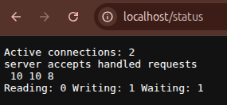  
Экспортируй контейнер в файл container.tar через команду export.  
Останови контейнер.  
Удали образ через docker rmi [image_id|repository], не удаляя перед этим контейнеры.  
Удали остановленный контейнер.  
Создай образ из файла container.tar через команду import.  
Создай и запусти контейнер на основе импортированного образа.  
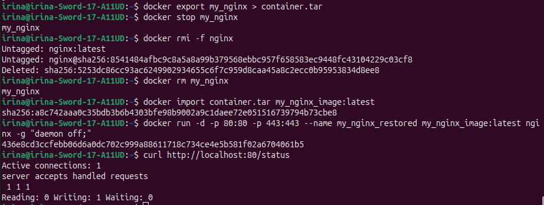  
Проверь, что по адресу localhost:80/status отдается страничка со статусом сервера nginx.  
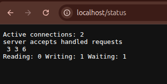  

## Part 3. Мини веб-сервер  

